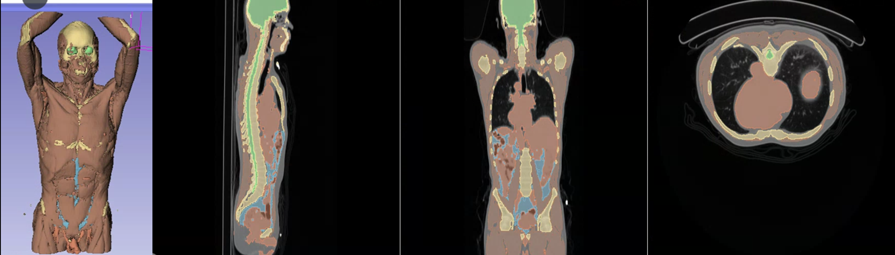
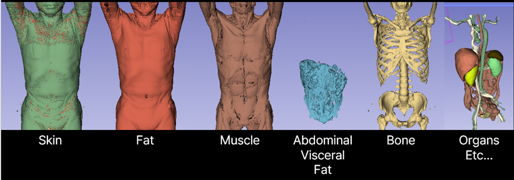
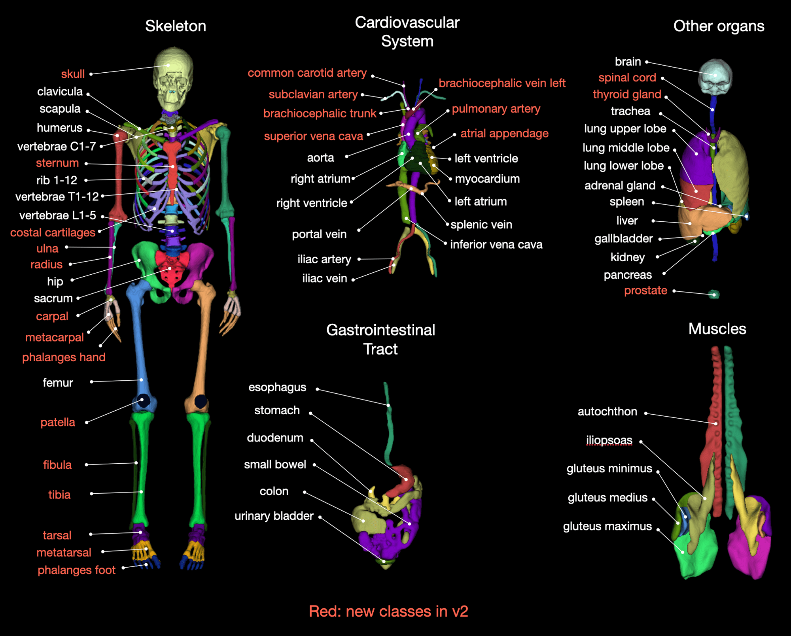

# Digital_Twin_Segmentation

Digital Twin은 의료 분야에서 다양한 사안에 대해서 활용될 수 있음.
- **환자 CT 데이터 모니터링**
    - 환자가 촬영했던 CT 데이터에 대해서 3D로 이해하기 쉽게 보여줄 수 있습니다.
- **진단과 예측**
    - 메디컬 트윈을 통해서 폐암과 유방암등 예측 모델을 통해서 여러 병변에 대해서 진단 및 예측을 진행 할 수 있습니다.
- **치료 계획 및 개인화된 의료 서비스**
    - 치료 전후의 CT 데이터를 메디컬 트윈을 통해서 3D로 만들게 되면 치료 전후 차이에 대해서 이해하기 쉽습니다.
    - 환자의 개별 CT 데이터를 통해서 만들기 때문에 개인화된 치료 계획을 세우는데 큰 도움이 됩니다.
- **향후 의료 연구 연계**
    - 혈관 및 여러 장기에 대해서 메디컬 트윈을 통해서 분할이 가능하다고 하면 고혈압 및 뼈 골절 등 여러 의료 연구와 관련하여 연계가 가능할 것으로 보입니다.

그림 1. 전신 CT 어노테이션 예시. 위와 같이 전문의의 마스킹 데이터를 바탕으로 인공지능 학습이 진행한 결과

# Data
https://zenodo.org/record/8367088

* 데이터수 : 1228
* Organ : 117

- 확보 데이터 : 1500개로 실험 진행
    - 라벨링 작업 진행 시작함